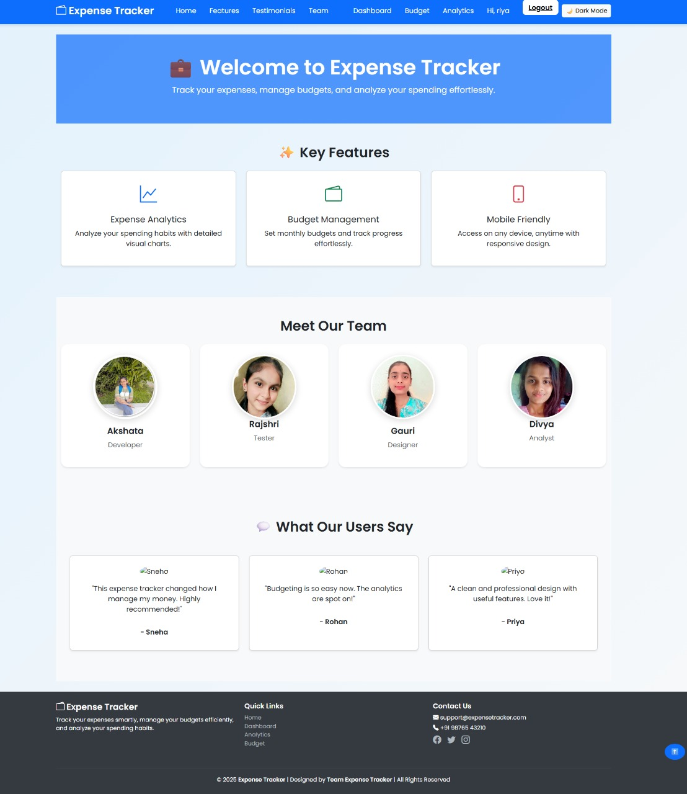
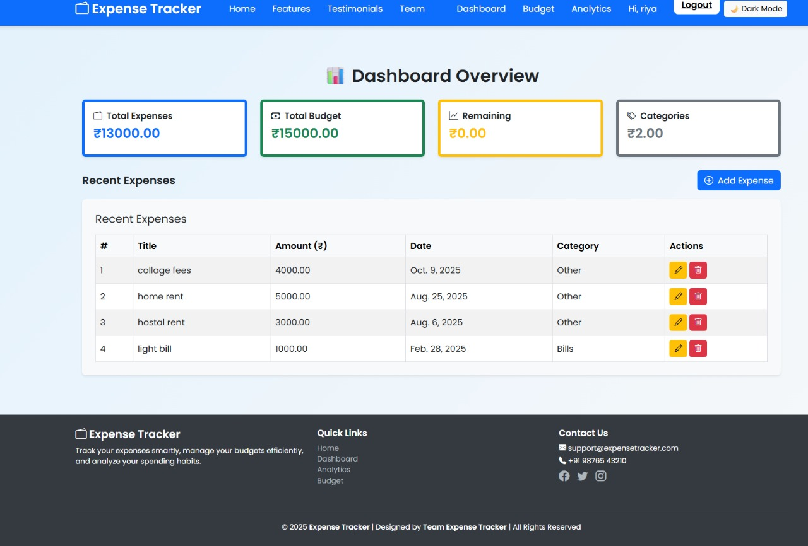

# Smart Expense Tracker 📱

A smart and user-friendly Android application for managing personal expenses and income efficiently.

## 📌 About the Project

**Smart Expense Tracker** is an Android application developed using **Java and Android Studio**. The application helps users manage their daily expenses and income, track transactions, manage budgets, and view financial information in an organized way.

This project was developed as an academic project to gain practical experience in **Android application development, Java programming, UI design, database management, and software development**.

## ✨ Features

* 🔐 User Registration & Login
* 💰 Add and manage expenses
* 💵 Add and manage income
* 📊 Dashboard for financial overview
* 🧾 Transaction history
* 🎯 Budget management
* 📈 Expense analysis and reports
* 👤 User profile
* 🔔 Expense reminders
* ⚙️ Application settings

## 🛠️ Technologies Used

* Java
* Android Studio
* XML
* Gradle
* SQLite / Local Database

## 📱 Application Screenshots

### 1. Welcome to Expense Tracker

### 2. Dashboard

### 3. Budget Management

### 4. Expense Analysis

## 🚀 Getting Started

### Prerequisites

* Android Studio
* JDK
* Android SDK

### Installation

1. Clone this repository.
2. Open the project in Android Studio.
3. Let Gradle sync complete.
4. Connect an Android device or start an Android Emulator.
5. Build and run the application.

## 🎓 Academic Project

This project was developed as an academic Android application project to gain practical experience in Java, Android development, UI design, database management, and application development.

📱 **Smart Expense Tracker**
Android application developed using **Java and Android Studio** for managing expenses, income, budgets and financial analysis.

🔗 [View Project](https://github.com/gauri2610/smart-expense-tracker)

🧠 **Quiz Application**
Android quiz application developed using **Java and Android Studio**, featuring multiple quiz categories, timer, score tracking and an interactive user interface.

🔗 [View Project](https://github.com/gauri2610/Quiz-Applicationapp)

## 👩‍💻 Developer

**Gauri Wankhede**

BE Computer Engineering Student | SPPU, Pune

GitHub: [@gauri2610](https://github.com/gauri2610)

